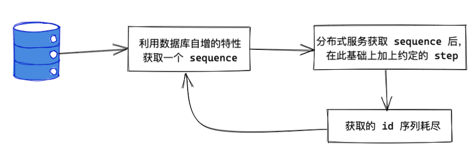
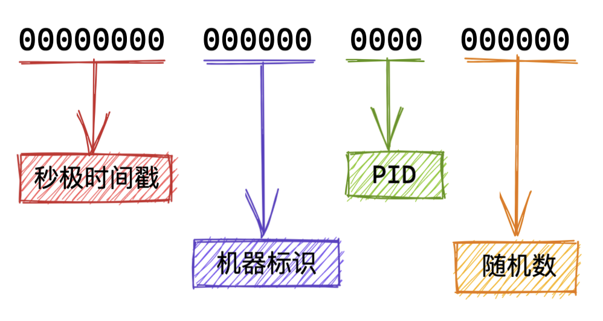
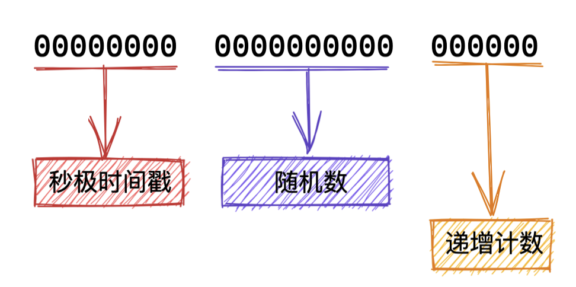
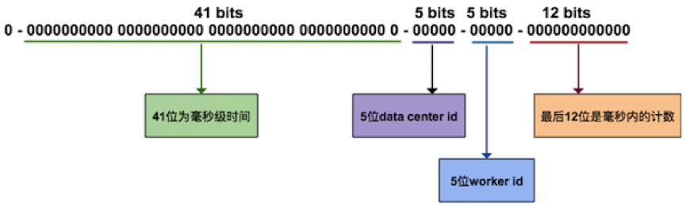

在分布式系统中，有些场景需要使用全局唯一 ID，一来作为业务标识，一来为了满足接口的幂等性设计。例如我们文件系统中的 fid。  
单表情况下我们可以直接使用数据库的自增id，但是分库分表后就无法满足需求了，需要想办法通过其他手段来实现。  
对于全局唯一ID，需要具备的特性：
* 全局唯一
* 递增
* 高可用
* 自主性
* 安全性（不会暴露）

### 利用数据库自增id生成
#### 实现方式

* 利用 MySQL 数据库自增 id 的特性获取到一个 sequence
* 上层服务（多台机器）获取到 sequence，然后在此基础上逐步累加 step。相当于每次获取到的 sequence 共有 step 个id可用
* 获取到的 id 用尽后，重新获取 sequence

#### 优点
* 天然有序
* 理解起来容易，实现起来简单

#### 缺点
* “下发 sequence 的服务” 以及 “数据库” 是单点（使用多个水平库来生成 sequence，自增id设置不同的初始值以及步长）
* 数据库迁移，需要提前预留出足够的 sequence，防止冲突
* 服务器重启、单点故障会导致 id 不连续
* 暴露一天的数据量

### UUID
#### 实现方式
#### 优点
* 无需依赖中间件或三方服务，可自主生成
* 高并发
* 各个语言均有实现库可直接使用

#### 缺点
* 字符串存储，占空间，DB查询及索引效率差
* 不是自增id，可读性差
* 不同的实现方式可能泄漏信息

### Redis/MongoDB 文档全局唯一ID/zookeeper
#### 实现方式
* **Redis**  
利用 redis 单线程的特性，使用 incr 或 increby 生成 id
* **MongoDB 的 objectId**  
3.2 及之前版本  

3.2 之后版本  

* **zookeeper 数据节点的版本**

#### 优点
* 性能相较于数据库会好上很多
* 可以集群部署
* 生成的id 可以带上时间信息

#### 缺点
* 需要引入中间件，增加系统复杂度
* 下发 id 的服务同样是一个单点

### 雪花算法
#### 实现方式

* 41bits 作为毫秒数。大概可以用 69.7 年
* 10bits 作为机器编号（5bits 是数据中心，5bits 的机器 ID），支持 1024 个实例
* 12bits 作为毫秒内的序列号。一毫秒可以生成 4096 个序号

#### 优点
* 本地生成，没有网络消耗，不需要引入中间件
* 高并发
* 包含时间信息

#### 缺点
* 依赖于机器时钟，同一台机器如果把时间回拨，生成的 ID 就会有重复的风险  
解决方案：  
    * 将ID生成交给少量服务器，并关闭时钟同步。
    * 直接报错，交给上层业务处理。
    * 如果回拨时间较短，在耗时要求内，比如5ms，那么等待回拨时长后再进行生成。
    * 如果回拨时间很长，那么无法等待，可以匀出少量位（1~2位）作为回拨位，一旦时钟回拨，将回拨位加1，可得到不一样的ID，2位回拨位允许标记三次时钟回拨，基本够使用。如果超出了，可以再选择抛出异常。

可以看到我们采用的方案并没有满足全部全局ID的特性，就好像分布式系统的 CAP 特性，我们只能尽量多的满足其中的特性。

没有最好的方案，只有最合适的方案。